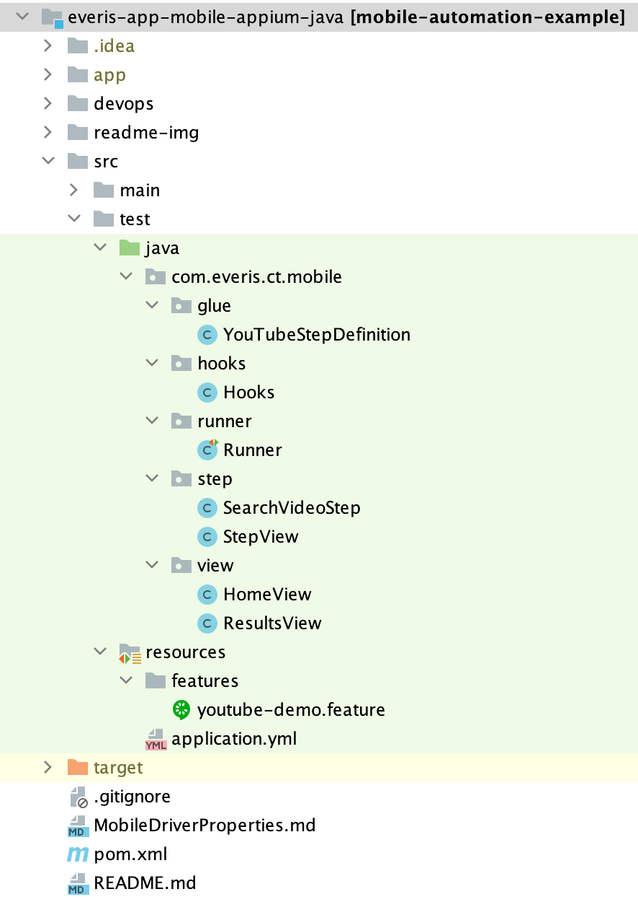

# MOBILE AUTOMATION

* Integración entre SpringBoot + Appium + Cucumber
* Librería core: Appium

## Integración de SpringBoot + Cucumber

Para crear el contexto de ejecución con SpringBoot y reconocimiento de ejcución de Test con Cucumber.
Agregar las siguientes etiquetas sobre la clase 'glue' o 'StepDefinition'

```
@CucumberContextConfiguration
@SpringBootTest
public class YouTubeStepDefinition {}
```

## Arquetipo del Módulo de Pruebas



## SetUp del driver

### Ejecución en un solo dispositivo

Para instanciar una nueva sesión del driver de tipo AppiumDriver<MobileElement>, debe llamarse al siguiente metodo en
los pasos de precondicion para generar el contexto:

```
@Autowired
private MobileDriverManager mobileDriverManager; 
...
mobileDriverManager.setUpDriver();
```

### Ejecuciónes en paralelo

Para instanciar una nueva sesión del driver de tipo AppiumDriver<MobileElement>, debe llamarse al siguiente metodo en
los pasos de precondicion para generar el contexto:

```
@Autowired
private MobileDriverManager mobileDriverManager; 
...
mobileDriverManager.setUpBasicParallelDriver(port, udid, platformName);
```

* Donde:

```
- port: Puerto del nodo de appium ejecutandose sobre el Grid de Selenium
- udid: Identificador unico del dispositivo
- platformName: Plataforma de ejecución (Android - iOS)
```

## Toma de evidencias

Para tomar evidencias antes y despues de los metodos de la clase de tipo Step, agregar sobre los metodos las siguientes etiquetas:

```
@TakeScreenShotBefore = Toma evidencia antes de la ejecucion del metodo
@TakeScreenShotAfter = Toma evidencia despues de la ejecucion del metodo
```

## Instanciar el objeto Scenario para la creación de reportes y captura de evidencia

Este objeto es capturado y enviado en la clase de tipo 'glue' o 'stepDefinition'

```
@Autowired
private ManageScenario manageScenario;
...
@Before
public void beforeScenario(Scenario scenario) {
    manageScenario.setScenario(scenario);
}
```

## Detener el driver

Se puede llamar al metodo para cerrar el driver en cualquier parte del codigo de la siguiente manera:

```
@Autowired
private MobileDriverManager mobileDriverManager;
...
mobileDriverManager.quitDriver();
```

## Accediendo a los metodos de ejecución de Appium

En la ultima capa de objectos relacionados dentro del Modulo de pruebas donde se encuentran las clases de tipo PageObject. 
Se va acceder al Framework de Mobile a através de la extensión de la Clase MobileBase.

```
public class HomeView extends MobileBase {

@AndroidFindBy(xpath = "//android.widget.ImageView[@content-desc='Search' or @content-desc='Buscar']")
private MobileElement searchButton;
...
```


Enviando el driver a la clase MobileBase dentro del constructor 'super()' de las clases PageObject a través del metodo static MobileDriverManager.getDriver();

```
public class HomeView extends MobileBase {

...
    public HomeView() {
        super(MobileDriverManager.getDriver());
    }
...
```

## Integración DataSources JDC
La librería tiene como dependencia "spring-boot-starter-jdbc" lo que permite conectarnos a una BD con solo declarar las
propiedades que necesita springBoot para realizar la conexión a BD.

```
spring:
  dataSource:
    driver-class-name: org.postgresql.Driver
    url: jdbc:postgresql://localhost:54322/xxxxx
    username: xxxxx
    password: xxxx
```

También, la librería internamente ya cuenta con el driver de conexión a la BD "postgresql" en runTime, por lo que ya no es
necesario agregar en el pom.xml del proyecto. En caso querramos conectarnos a otro Driver de BD, esta dependencia debería agregarse
en el archivo pom.xml del proyecto.

Para acceder al utilitario con metodos de ayuda para manejar la BD donde nos vamos a conectar, debemos inyectar la siguiente dependencia
en nuestro objecto:

```
 @Autowired
 private JDBCOperations jdbcOperations;
 
 ...
 
 public void method(){
  jdbcOperations.countRow("public.demoTable");
 }
```

**_Métodos utilitarios:_**
Revisar objecto demo: **com.everis.ct.api.jdbcDemo/JdbcTest.java**

## Generación de reporte HTML Cucumber

Para generar un reporte HTML local de los resultados con cucumber, es necesario agregar el siguiente plugin en la sección </build> del archivo pom.xml

```
            <plugin>
                <groupId>net.masterthought</groupId>
                <artifactId>maven-cucumber-reporting</artifactId>
                <version>5.6.2</version>
                <executions>
                    <execution>
                        <id>cucumber-reports</id>
                        <phase>verify</phase>
                        <goals>
                            <goal>generate</goal>
                        </goals>
                        <configuration>
                            <projectName>cucumber-jvm-example</projectName>
                            <skip>false</skip>
                            <outputDirectory>${project.build.directory}/site</outputDirectory>
                            <!-- optional, defaults to outputDirectory if not specified -->
                            <inputDirectory>${project.build.directory}/build</inputDirectory>
                            <jsonFiles>
                                <param>**/*.json</param>
                            </jsonFiles>
                        </configuration>
                    </execution>
                </executions>
            </plugin>
```

Donde, las configuraciones:

* **outputDirectory=** Indica el directorio en donde se generará el reporte HTML de cucumber. En el ejemplo, la ruta especfica el directorio **_Target_** y la carpeta **_/site_**
* **cucumberOutput=** Indica la ruta del archivo output generado posterior a la ejecución. La ruta de este archivo debe coincidir con el especificado en las **_opciones de cucumber_** en la clase Runner.

Por último, realizar la ejecución de un goal  por comandos. Se recomienda utilizar el goal clean para limpiar ejecuciones anteriores.

```
$ mvn clean verify
```

## Configuración de las Opciones de Cucumber

* **@CucumberOptions()** = Soportará las opciones de cucumber
* **plugin = {"json:target/build/cucumber.json"}** = Json que guardar la trazabilidad de ejecución de Cucumber, Posteriormente se usara para la integración con Jira.
* **stepNotifications = true** = Muestra el paso a paso de la ejecución (Opcion cosmetica).
* **publish = true** = Publica un reporte 'público' en el servidor de Cucumber (Este reporte no requiere autorización).
* **features = {"src/test/resources/features"}** = Indica donde están alojados los features.
* **glue = {"com.everis.ct.web.glue"}** = Indica donde está ubicada la definición de los pasos
* **tags = "@REG_GOOGLE"** = Tag indicador de una prueba o un conjunto de pruebas

```
@CucumberOptions(plugin = {"json:target/build/cucumber.json"}, 
        stepNotifications = true,
        publish = true, 
        features = {"src/test/resources/features"}, 
        glue = {"com.everis.ct.web.glue"},
        tags = "@REG_GOOGLE"
)
public class Runner {}
```

## Integración con Jira y JiraXray

Para integrar las pruebas con el plugin Xray de Jira, utilizar la siguiente configuración:

```
@RunWith(Cucumber.class)
@CucumberOptions(plugin = {"json:target/build/cucumber.json"},
        stepNotifications = true,
        publish = true,
        features = {"src/test/resources/features"},
        glue = {"com.everis.ct.web.glue"},
        tags = "@REG_GOOGLE"
)
public class Runner {
...
    @AfterClass
    public static void afterExecution() {
        Logger.getLogger(Runner.class.getName()).log(Level.INFO, "AFTER EXECUTION --->");
        JiraXray.importResults();
    }   
```

Configuración de propiedades para Jira

**-jxray.integration**= Activa o desactiva la integración con Jira. Por defecto el valor es 'false'

**-jxray.host**= Host de Jira

**-jxray.client.id**= Credencial generada en la plataforma de Jira. Client Id

**-jxray.client.secret**= Credencial generada en la plataforma de Jira. Secret Id

```
jxray:
  integration: off
  host: "https://xray.cloud.xpand-it.com"
  client:
    id: XXXXX
    secret: XXXXX
```

## Extent Report - PDF y HTML

El FrameWork genera también otro tipo de reportería soportado por la librería **_'extentreports-cucumber6-adapter'_**

Para poder acceder a esta otra alternativa, completar los siguientes pasos.

1. En las opciones de cucumber, en la opción **'plugin'**, agregar el adaptador de la libreria extent _**"com.aventstack.extentreports.cucumber.adapter.ExtentCucumberAdapter:"**_
```
@RunWith(Cucumber.class)
@CucumberOptions(plugin = { "pretty", "json:target/build/cucumber.json",
        "com.aventstack.extentreports.cucumber.adapter.ExtentCucumberAdapter:"
        },
        stepNotifications = true,
        monochrome = true,
        publish = true,
        features = {"src/test/resources/features"},
        glue = {"com.pichincha.sw.web.glue"},
        tags = "@TAG"
)
```

2. Crear el archivo de propiedades _**"extent.properties"**_ en el directorio de recursos: _**src/test/resources**_ y copiar el siguiente contenido:

* Modificar los datos entre "< >"

```
extent.reporter.spark.start=true
extent.reporter.spark.config=src/test/resources/extent-config.xml
extent.reporter.spark.out=test-output/SparkReport/
screenshot.dir=test-output/
screenshot.rel.path=../
extent.reporter.pdf.start=true
extent.reporter.pdf.out=test-output/PdfReport/<NOMBRE_DEL_REPORTE>.pdf
extent.reporter.spark.base64imagesrc=true
extent.reporter.spark.vieworder=dashboard,test,category,exception,author,device,log
systeminfo.os=<CONTEXTO_SISTEMA_OPERATIVO>
systeminfo.user=<ACTOR_EJECUTOR>
systeminfo.build=<VERSION_BUILD>
systeminfo.AppName=<NOMBRE_DEL_APP>
```

3. Crear el archivo xml _**"extent-config.xml"**_ en el directorio de recursos: _**src/test/resources**_ y copiar el siguiente contenido:

```
<?xml version="1.0" encoding="UTF-8"?>
<extentreports>
    <configuration>
        <!-- report theme -->

        <!-- standard, dark -->

        <theme>dark</theme>
        <!-- document encoding -->

        <!-- defaults to UTF-8 -->

        <encoding>UTF-8</encoding>
        <!-- protocol for script and stylesheets -->

        <!-- defaults to https -->

        <protocol>http</protocol>
        <!-- title of the document -->
        <documentTitle>Extent</documentTitle>
        <!-- report name - displayed at top-nav -->

        <reportName>Grasshopper Report</reportName>
        <!-- location of charts in the test view -->

        <!-- top, bottom -->

        <testViewChartLocation>bottom</testViewChartLocation>
        <!-- custom javascript -->

        <scripts>

            <![CDATA[
$(document).ready(function() {
});
]]>
        </scripts>
        <!-- custom styles -->
        <styles>
            <![CDATA[
]]>
        </styles>
    </configuration>
</extentreports>
```

4. Ejecutar la prueba desde la clase Runner o por comandos. Al finalizar se creara una carpeta en el root del proyecto con los reportes en formato PDF y HTML.

##Recomendaciones

** Se recomienda utilizar una clase @Component que centralise las creación de los ViewObject
y posteriormente inyectar las dependencias en las clases **Step**

```
@Component
public class Views {

    protected GoogleSearchPage search(){
        return new GoogleSearchView();
    };

    protected GoogleResultsPage results(){
        return new GoogleResultsView();
    }

}

---
public class GoogleSearchStep {

 @Autowired
 private Views view;
 
...
 public void searchData(String data) {
        //metodo de accion en el PageObject
        page.search().writeSearch(data); 
 }
```

** Se recomienda utilizar la siguiente estretegia de capturas de evidencias:

- _**@ScreenShotBefore**_ = [Scope: **Method**] - Captura la evidencia antes de la ejecución del método.
- _**@ScreenShotAfter**_ = [Scope: **Method**] Captura la evidencia despues de la ejecución del método.
- _**scenario.shotWhenFail();**_ = [Scope: **After Scenerio**] Captura la evidenc